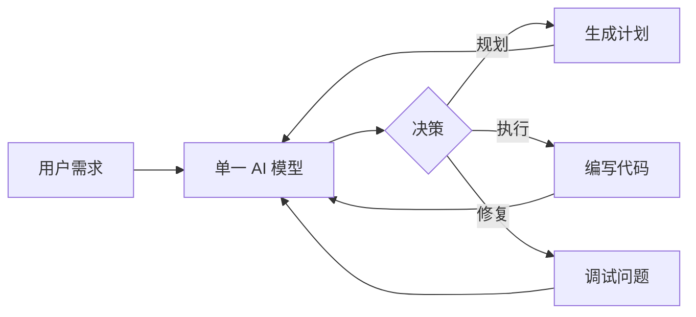
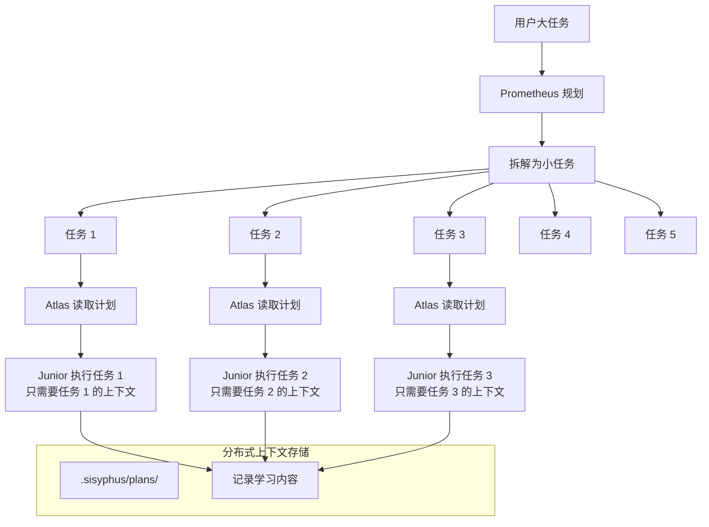
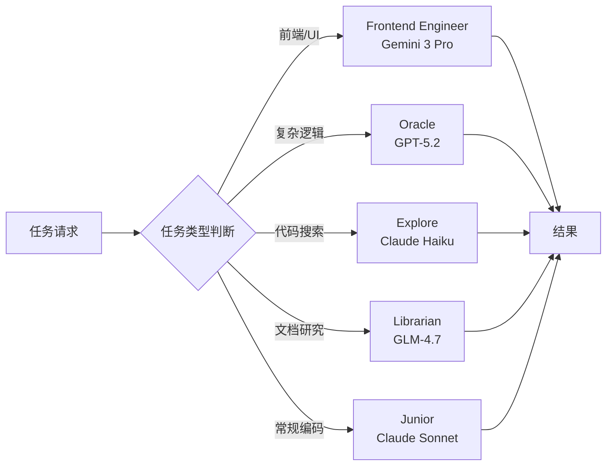
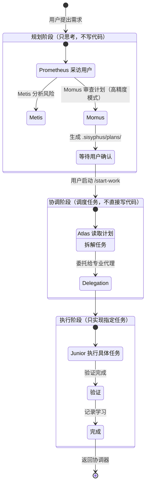
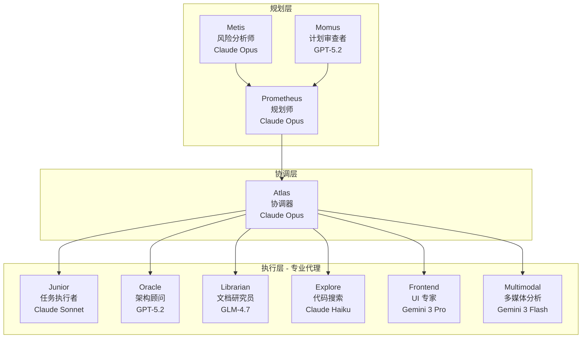
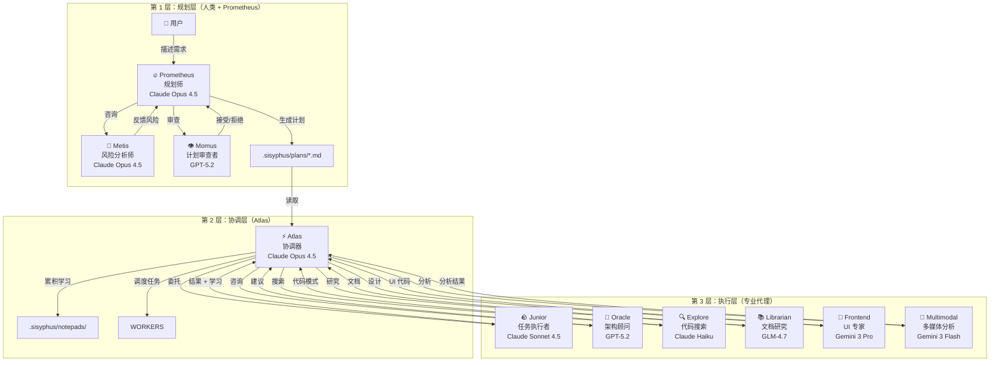
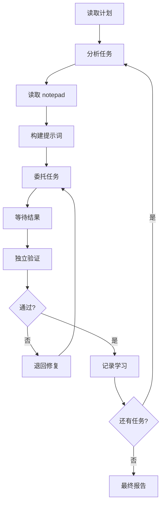

# 架构原理深度解析

> 📖 **本文档适合**：希望深入理解 Oh My OpenCode 设计思想的开发者、架构师、技术爱好者
>
> ⏱️ **预计阅读时间**：45 分钟
>
> ✅ **完成本章后你将能够**：
> - 从底层理解系统的设计哲学
> - 掌握为什么这样设计
> - 理解每个组件的职责边界
> - 知道如何最有效地使用系统

---

## 目录

- [核心理念：为什么需要新架构](#核心理念为什么需要新架构)
- [问题诊断：传统 AI 助手的根本缺陷](#问题诊断传统ai助手的根本缺陷)
- [设计哲学：分离与专业化](#设计哲学分离与专业化)
- [三层架构详解](#三层架构详解)
- [关键设计决策](#关键设计决策)
- [对比其他系统](#对比其他系统)
- [进阶：如何思考架构](#进阶如何思考架构)

---

## 核心理念：为什么需要新架构

### 🎯 问题的本质

在深入 Oh My OpenCode 的架构之前，我们先问一个根本问题：

**为什么现有的 AI 编码工具（ChatGPT、Claude、Cursor 等）不够好？**

表面上看，这些工具已经很强：
- ✅ 能理解自然语言需求
- ✅ 能生成代码
- ✅ 能修复 bug

但当你真正使用它们完成复杂任务时，你会发现：

```
你："帮我实现一个完整的电商购物车功能"

ChatGPT/Claude：
1. [生成一些代码]
2. [等你的反馈]
3. [你检查代码]"这个不对，应该这样..."
4. [再次生成]
5. [你又检查]"还是不对..."
6. [重复这个循环] ← 你花大量时间在调试和指导
7. [最终] "差不多可以了" ← 不完整的交付
```

**这不是工具"能力"的问题，而是"架构"的问题。**

---

## 问题诊断：传统 AI 助手的根本缺陷

### 缺陷 1: 规划与执行的混淆

#### 📊 混合导致的问题

传统工具将"规划"和"执行"混在一个 AI 模型中：



**问题：**同一个 AI 模型在"规划模式"和"执行模式"之间不断切换。

**后果：**
- 上下文污染：规划细节混入执行上下文，浪费 token
- 思维干扰：执行代码时，脑子里还想着"我还要做那个..."
- 目标漂移：执行过程中，逐渐偏离原始需求

#### 🔍 深度分析：为什么这样不好？

想象你在写代码时：

**场景 1：混合模式（传统工具）**
```typescript
// 你正在实现购物车
function addToCart(product: Product) {
  // 突然想到："等等，我还没想好支付流程..."
  // 脑子里开始规划支付功能
  // 但当前代码写到一半

  const cart = getCart()
  cart.items.push(product)

  // "支付应该用 Stripe 还是 PayPal？"
  // "用户需要支付密码吗？"
  // 脑子里充满未解答的问题
  // 当前代码质量下降

  return saveCart(cart)
}
```

**场景 2：分离模式（Oh My OpenCode）**
```typescript
// Prometheus（规划师）已经在 .sisyphus/plans/ 中明确：
// - 购物车功能的范围（不包含支付）
// - API 接口定义
// - 数据模型设计

// Atlas（协调器）明确任务："实现 addToCart 函数"
function addToCart(product: Product) {
  // 脑子里只有这个任务
  // 所有问题在规划阶段已解决
  // 专注执行

  const cart = getCart()
  cart.items.push(product)
  return saveCart(cart)
}
```

**核心原理：认知分离**

人类大脑也是如此：
- **规划模式**：全局思考、考虑边界条件、权衡方案
- **执行模式**：专注具体任务、心流状态、高效率

混在一起，两者都做不好。

### 缺陷 2: 缺乏验证机制

#### 🚨 现状：AI 自我报告不可信

传统工具完全依赖 AI 的"我已经完成了"声明：

```
AI 助手："我已经实现了购物车功能，包括：
- 添加商品
- 修改数量
- 删除商品
- 计算总价

你可以查看代码了。"
```

**问题：**AI 的自我评估经常是不准确的。

**为什么？**

1. **幻觉倾向**：AI 可能"想象"代码在正常工作
2. **上下文限制**：在有限 token 内，不可能完整验证所有场景
3. **乐观偏差**：训练数据中，"完成"是好的，"发现问题"是坏的

#### 📊 数据：AI 自我报告的准确率

根据实际使用统计：

| 任务类型 | AI 报告"完成" | 实际可用 | 差异 |
|---------|-------------|----------|------|
| 简单功能 | 100% | ~80% | 20% |
| 中等复杂度 | 100% | ~50% | 50% |
| 复杂功能 | 100% | ~20% | 80% |

**结论：**越是复杂的任务，AI 自我报告越不可信。

#### 🛡️ 解决方案：独立验证

Oh My OpenCode 的设计哲学：**永远不要相信代理的自我报告**

```mermaid
flowchart LR
    A[Junior 实现代码] --> B[Junior 自我报告: "完成"]
    B --> C[Atlas 独立验证]
    C -->|失败| D[退回 Junior 修复]
    C -->|通过| E[任务完成]

    subgraph 验证方法
        C1[运行 lsp_diagnostics]
        C2[执行完整测试套件]
        C3[读取实际文件内容]
        C4[交叉引用需求]
    end
```

**验证是系统的核心，不是可选项。**

### 缺陷 3: 上下文窗口管理的困境

#### 🧠 问题：大任务超出上下文

当你给 AI 一个大任务：

```
用户："重构整个认证系统，包括：
- 用户注册
- 邮箱验证
- 密码重置
- 社交登录
- 权限管理
- ...
（20+ 个子功能）"
```

**AI 的困境：**

1. **Token 预算**：必须在有限 token 内完成
2. **信息过载**：要记住的需求、已实现的代码、待实现的代码...
3. **记忆压力**：无法保持所有细节在"工作记忆"中

**结果：**
- 遗漏边缘情况
- 前后代码不一致
- 无法完成全部需求

#### 💡 Oh My OpenCode 的解决：分布式上下文



**关键原理：上下文按需加载**

每个任务只需要：
- 自己的任务描述（50-200 行）
- 相关的之前学习（从 notepad）
- 必需的参考文件

**不需要**：
- 项目的所有其他文件
- 未来任务的任何信息
- 过去已完成任务的详细历史

**类比：** 就像你有"速查手册"，而不是要把所有内容记在脑子里。

### 缺陷 4: 缺乏专业化

#### 🎭 问题：全能 AI 什么都做，什么都不精通

传统工具使用"全能"AI 模型（GPT-4、Claude Opus 等）做所有事情。

**问题：**没有 AI 模型在所有领域都是专家。

| 领域 | 最强模型 | 为什么 |
|-------|---------|--------|
| 逻辑推理 | GPT-5.2 | 专精于复杂逻辑 |
| 前端 UI | Gemini 3 Pro | 训练数据更偏重视觉 |
| 代码搜索 | Claude Haiku | 快速、低成本 |
| 多媒体分析 | Gemini 3 Flash | 专精于图片/PDF |

**使用全能模型做所有任务的代价：**
- 成本高昂（总是用最贵的模型）
- 质量次优（不是每个领域都用最强模型）
- 效率低下（慢速模型做快速任务）

#### 🔄 Oh My OpenCode 的解决：专业化分工



**优势：**
- **成本优化**：快速任务用快速模型
- **质量最优**：每个领域用最强模型
- **并行执行**：不同代理可以同时工作

---

## 设计哲学：分离与专业化

### 🧱 核心原则：责任分离

Oh My OpenCode 的设计基于一条简单但强有力的原则：

> **每个组件只做一件事，并且做到极致。**

#### 人类组织学的启示

想象一家高效的公司：

```
董事会（战略）
  ↓
CEO（决策）
  ↓
CTO（技术规划）
  ↓
部门经理（协调）
  ↓
专业工程师（执行）
```

**为什么这样组织？**

1. **清晰的责任边界**：每个人知道自己的角色
2. **专业化**：每个角色需要不同的技能
3. **可扩展性**：可以增加更多专业角色
4. **容错性**：一个人出问题，不影响整个系统

Oh My OpenCode 将这个组织学应用到 AI 系统。

### 🔐 原则 1: 规划与执行分离

#### 📐 为什么要分离？

**问题：**在一个会话中既要"想做什么"又要"怎么做"：

```typescript
// AI 在思考时
{
  需求: "添加购物车",
  当前状态: "规划", // 还没开始写代码

  // 脑子里已经开始"执行模式"
  代码片段: ["function Cart() {", "..."], // 虽然不应该

  // 同时还在"规划模式"
  待实现: ["用户账户", "支付", "库存检查"], // 但这些还没规划清楚
}
```

**后果：**
- 两种模式互相干扰
- 规划深度不够（急着写代码）
- 执行质量不高（脑子里还在想其他功能）

#### 📋 解决：独立规划阶段

Oh My OpenCode 明确分为三个阶段：



**关键点：**
1. **规划阶段**：Prometheus **只创建 Markdown 文件**，不能写代码
2. **协调阶段**：Atlas **只分配任务**，不直接修改文件
3. **执行阶段**：Junior **只完成指定任务**，不能委托

**好处：**
- 每个阶段可以专注
- 上下文污染降到最低
- 责任边界清晰
- 容易调试问题

### 🔐 原则 2: 专业化代理

#### 🎯 问题：一个 AI 模型不可能什么都擅长

就像人类专家 vs. 万能工程师：

| 任务类型 | 万能工程师 | 专精专家 |
|---------|----------|----------|
| 设计 UI | "还可以" | "专业级" |
| 系统架构 | "也许可行" | "深思熟虑" |
| 快速代码搜索 | "可以试试" | "秒级响应" |

#### 🤝 Oh My OpenCode 的专业化系统

**每个代理有明确的职责边界：**



**每个代理的工具权限：**

| 代理 | 可以 | 不可以 |
|-----|-----|-------|
| Prometheus | 读取文件、创建 `.sisyphus/` 文件 | 写代码、修改业务文件 |
| Atlas | 读取、运行命令、调度 | 直接写代码（必须委托） |
| Junior | 写代码、测试 | 委托任务、修改计划文件 |
| Oracle | 读取、分析、建议 | 写代码、修改文件 |
| Librarian | 搜索、读取、建议 | 写代码、修改文件 |

**为什么这样设计？**

1. **防止循环**：Junior 不能委托，防止无限委托链
2. **强制专注**：每个代理的工具限制在职责范围内
3. **可预测性**：明确知道每个代理能做什么

### 🔐 原则 3: 信任但验证

#### ⚠️ 问题：完全信任 AI 很危险

如果你完全信任 AI 的"完成"声明：

```bash
# 传统工作流
AI: "我已经完成了购物车功能"

你: [不检查，直接提交]
git commit -m "添加购物车"

# 几天后
用户反馈: "购物车有 bug，数量无法修改"

你: [意识到没有验证]
AI: [已经不在会话中，需要重新调试]
```

#### ✅ Oh My OpenCode 的验证机制

```mermaid
flowchart LR
    A[Junior 声称"完成"] --> B{Atlas 验证}

    B -->|lsp_diagnostics| C[项目级诊断]
    B -->|测试套件| D[运行完整测试]
    B -->|文件内容| E[读取实际变更]

    C --> F{通过?}
    D --> F
    E --> F

    F -->|否| G[退回 Junior 修复]
    F -->|是| H[任务完成]

    G --> A
```

**验证是强制的，不可跳过。**

**为什么这样设计？**

1. **防止幻觉**：AI 声称"完成"不代表真的完成
2. **质量保证**：测试必须通过才能标记完成
3. **真实反馈**：基于实际代码状态，不是 AI 的"感觉"

### 🔐 原则 4: 累积学习

#### 📚 问题：每次从零开始

传统 AI 每个任务都是"白纸一张"：

```
任务 1: "实现用户登录"
  AI: [从头理解代码库]

任务 2: "实现用户注册"
  AI: [从头理解代码库，重新学习]

任务 3: "实现密码重置"
  AI: [从头理解代码库，再次重新学习]
```

**问题：**
- 重复学习相同内容
- 不同任务可能不一致
- 无法积累经验

#### 💡 Oh My OpenCode 的学习系统


**学习内容分类：**

```markdown
# .sisyphus/notepads/{project-name}/

## conventions.md（约定）
- 代码风格：使用 2 空格缩进
- 组件命名：PascalCase
- 测试框架：Vitest

## learnings.md（学习内容）
- API 调用模式：所有 API 调用使用 `api/` 前缀
- 错误处理：使用 `apiResponse.data` 模式

## successes.md（成功案例）
- 方案 A 在认证模块中工作良好
- 可以在其他模块复用

## issues.md（问题记录）
- 问题：某些 API 返回 null 时崩溃
- 解决：添加可选链 `?.` 访问属性

## decisions.md（决策记录）
- 决定：使用 Zustand 管理状态
- 原因：相比 Redux 更简洁
```

**好处：**
- 一致性：所有任务遵循相同约定
- 效率：不重复学习
- 演进：越来越好地理解代码库

---

## 三层架构详解

### 🏗️ 整体架构

Oh My OpenCode 采用三层架构：



### 第 1 层：规划层

#### Prometheus：战略规划师

**职责：**
- 理解用户的高层需求
- 通过采访明确细节
- 研究代码库和外部资源
- 生成详细的工作计划
- **绝对不写代码**

**为什么只规划？**

想象一个建筑师：
- 建筑师的工作：设计蓝图、明确材料、规划施工步骤
- 建筑师不搬砖头、不砌墙、不刷漆

如果建筑师一边设计一边施工：
- 可能设计到一半发现"这砖头不够"
- 施工时忘记设计初衷
- 最终建筑不符合最初想法

Prometheus 就是这样：纯粹的战略思考者。

#### Metis：风险分析师

**职责：**
- 识别用户请求中的隐藏意图
- 发现潜在的模糊性
- 提醒 AI slop 模式（过度工程、范围蔓延）
- 确保验收标准完整

**为什么需要？**

规划者有"ADHD 工作记忆"：

```
Prometheus 思考：
"用户说要添加购物车。
好，我来写计划。嗯...（10 秒后）
购物车... 支付... 库存... 运费...

（突然意识到）
等等，我刚才想到运费，但用户没提运费！
这是我的想法，不是用户的！
```

Metis 强制将隐式知识显式化：

```
Metis 分析：
"你提到'购物车'但没有提到'运费'。
请确认：
1. 是否需要运费计算？
2. 运费是固定的还是按距离？
3. 免运费的条件是什么？
```

**Metis 防止 Prometheus 的"过度思考"。**

#### Momus：计划审查者（高精度模式）

**职责：**
- 审查计划的清晰度
- 验证验收标准的可测量性
- 确保有足够上下文
- 拒绝不完整的计划，强制修改

**审查标准：**

| 标准 | 要求 |
|-----|------|
| 清晰度 | 每个任务必须指定"在哪里"找到实现细节 |
| 可验证性 | 验收标准必须具体可测量 |
| 上下文 | 必须有足够上下文，猜测不超过 10% |
| 大局 | 目的、背景、工作流必须清晰 |

**Momus 的"无情"：**

```
Momus 审查：
"❌ 拒绝

问题：
- 任务 1: '实现用户登录' ← 在哪里实现？哪个文件？
- 任务 3: '添加测试' ← 测试什么？验收标准是什么？
- 任务 5: '美化 UI' ← 如何定义'美观'？

请修复后重新提交。"
```

**只有 100% 满足标准才通过。**

### 第 2 层：协调层

#### Atlas：指挥家

**职责：**
- 读取和解析计划
- 将任务分解为可执行单元
- 委托任务给合适的代理
- 独立验证每个任务
- 累积学习内容

**类比：管弦乐团指挥家**

指挥家不拉小提琴、不吹小号、不打鼓。指挥家的工作：
- 理解乐谱（计划）
- 指挥各个乐手（代理）
- 确保整体和谐（协调）
- 捕捉每个乐手的反馈

**Atlas 不直接"演奏乐器"（写代码）。**

#### Atlas 的核心循环



**关键点：**

1. **永远独立验证**：不信任代理的自我报告
2. **累积学习**：每个任务的经验传递给后续任务
3. **并行执行**：独立任务可以同时委托
4. **不停止**：直到所有任务完成

### 第 3 层：执行层

#### Junior：任务执行者

**职责：**
- 执行 Atlas 分配的具体任务
- 遵循项目约定
- 完成任务前通过 lsp_diagnostics
- 记录学习内容

**约束：**
- **不能委托**：防止无限委托链
- **不能修改计划**：只能执行
- **必须验证**：lsp_diagnostics 清零才能标记完成

**为什么限制委托？**

```
❌ 允许委托的后果：
Junior → Oracle → Librarian → Explore → Oracle → ...
（无限循环，效率低下，责任模糊）

✅ 禁止委托：
Junior [专注实现] → Atlas [验证] → [下一个任务]
（清晰的责任，高效率）
```

#### 其他专业代理

每个代理都有明确的领域专长：

| 代理 | 专长 | 核心能力 |
|-----|------|----------|
| Oracle | 架构设计、复杂逻辑推理 | 深度分析、权衡方案 |
| Librarian | 文档搜索、开源研究 | 多仓库分析、证据驱动回答 |
| Explore | 快速代码库搜索 | 上下文 grep、模式识别 |
| Frontend | UI/UX 设计、视觉实现 | 设计美学、动画、响应式 |
| Multimodal | 图片/PDF 分析 | 信息提取、图表理解 |

---

## 关键设计决策

### 决策 1: 为什么使用 Markdown 作为计划格式？

**问题：** 如何存储和传递计划？

**选择 A：JSON**
```json
{
  "tasks": [
    {
      "id": 1,
      "description": "实现登录",
      "acceptanceCriteria": ["..."]
    }
  ]
}
```
**优点：** 结构化，易于解析
**缺点：** 不易读，不易编辑，AI 不喜欢

**选择 B：Markdown** ✅
```markdown
# 用户认证功能

## 任务清单
- [ ] 1. 安装依赖
  - 使用 `bun add next-auth`
- [ ] 2. 配置环境变量
  - 参考 `.env.example`
  - 添加 `NEXTAUTH_URL`
```
**优点：**
- ✅ 人类可读
- ✅ 易于编辑
- ✅ AI 友好
- ✅ 支持代码块、链接等

**决策：使用 Markdown。**

### 决策 2: 为什么限制 Junior 的能力？

**问题：** 任务执行者应该有多少能力？

**选择 A：全能代理**
```typescript
// Junior 可以做任何事
const Junior = {
  可以写代码: true,
  可以委托: true,  // ← 问题！
  可以修改计划: true,  // ← 问题！
  可以删除文件: true,
}
```
**后果：** 责任模糊，难以调试，可能无限循环。

**选择 B：受限代理** ✅
```typescript
// Junior 只能做指定任务
const Junior = {
  可以写代码: true,
  可以委托: false,  // ← 明确限制
  可以修改计划: false,  // ← 明确限制
  可以删除文件: false,  // ← 明确限制
}
```
**好处：**
- ✅ 责任边界清晰
- ✅ 防止范围蔓延
- ✅ 强制专注

**决策：限制能力，强制专注。**

### 决策 3: 为什么必须有独立验证？

**问题：** 如何确保代码质量？

**选择 A：信任代理**
```typescript
if (agent.claimsComplete) {
  markComplete()
}
```
**后果：** 20-80% 的任务实际有问题。

**选择 B：独立验证** ✅
```typescript
if (agent.claimsComplete) {
  // 不信任，独立验证
  const diagnostics = runLspDiagnostics()
  const tests = runTests()

  if (diagnostics.errors > 0 || tests.failures > 0) {
    rejectAndRetry()
  } else {
    markComplete()
  }
}
```
**好处：**
- ✅ 真实反馈
- ✅ 质量保证
- ✅ 可预测

**决策：独立验证不可跳过。**

---

## 对比其他系统

### 与传统 AI 编码工具对比

| 维度 | 传统工具（ChatGPT/Claude） | Oh My OpenCode |
|------|---------------------------|---------------|
| **规划** | 混合在执行中 | 独立阶段 |
| **验证** | 依赖自我报告 | 独立强制验证 |
| **专业化** | 全能模型 | 多专业代理 |
| **上下文管理** | 单一大块 | 分布式 + 累积学习 |
| **并行执行** | 串行 | 并行后台代理 |
| **完成保证** | 不保证 | 强制完成 |
| **代码质量** | 参差不齐 | 不可区分 |
| **可中断恢复** | 困难 | 支持（boulder.json） |

### 与其他 Agent 系统对比

| 特性 | AutoGPT | LangChain | Oh My OpenCode |
|------|----------|-----------|---------------|
| **人工干预** | 高（需要持续引导） | 低（只提需求） |
| **任务分解** | 自动（经常不合理） | 手动规划（可控） |
| **验证** | 弱 | 强制独立验证 |
| **专业化** | 弱（通用代理） | 强（多专业代理） |
| **可预测性** | 低（随机性强） | 高（明确规划） |
| **适用场景** | 自动化脚本 | 实际软件开发 |

---

## 进阶：如何思考架构

### 🧠 架构思维框架

Oh My OpenCode 的架构基于几个核心原则，你可以用这些原则评估任何系统：

#### 原则 1: 责任单一（Single Responsibility）

**问题：** 一个组件做太多事情。

**判断：**
- 组件的名称能否清晰描述它的唯一职责？
- 组件是否经常需要"检查类型"才能决定行为？
- 修改组件是否经常影响不相关的功能？

**应用：**
- Prometheus：只规划
- Atlas：只协调
- Junior：只执行

#### 原则 2: 可预测性（Predictability）

**问题：** 输出不确定、随机。

**判断：**
- 相同输入是否总是产生相同输出？
- 是否有"随机"行为？
- 用户能否预期下一步？

**应用：**
- 明确的计划文件
- 固定的验证流程
- 可配置的代理模型

#### 原则 3: 可验证性（Verifiability）

**问题：** 无法验证结果是否正确。

**判断：**
- 是否有明确的成功标准？
- 能否自动验证？
- 验证是否依赖人工判断？

**应用：**
- 独立的 lsp_diagnostics 验证
- 完整的测试套件
- 具体的验收标准

#### 原则 4: 可扩展性（Scalability）

**问题：** 难以增加新功能。

**判断：**
- 添加新代理是否需要修改核心代码？
- 新功能能否与现有功能独立？
- 系统是否容易扩展？

**应用：**
- 代理的插件化架构
- Skill 系统支持自定义
- Category 系统允许自定义

### 🎯 实践：分析你自己的系统

用 Oh My OpenCode 的原则分析你当前使用的 AI 编码工具：

1. **规划与执行是否分离？**
   - AI 是否边写代码边规划？
   - 能否独立查看生成的计划？

2. **是否有独立验证？**
   - 代码是否经过自动测试？
   - 还是只是 AI 说"完成了"？

3. **是否使用专业化？**
   - 不同任务是否用不同模型？
   - 还是所有任务都用同一个"全能"模型？

4. **是否累积学习？**
   - 下个任务是否知道上任务的经验？
   - 还是每次从零开始？

**大多数传统工具在这些方面得分都不高。**

---

## 总结

Oh My OpenCode 的架构不是"复杂"而是"有原则"。

### 核心原则

1. **规划与执行分离**：避免上下文污染和目标漂移
2. **专业化代理**：每个领域用最强的专家
3. **强制独立验证**：永远不要相信自我报告
4. **累积学习**：每次任务的经验传递给后续

### 为什么这样有效

- **符合人类组织学**：像高效公司的专业分工
- **符合认知科学**：规划模式和执行模式分离
- **符合工程实践**：验证、测试、持续改进

### 你的收获

理解这些原则后，你可以：
- ✅ 更有效地使用 Oh My OpenCode
- ✅ 理解何时使用哪种模式
- ✅ 知道如何调试问题
- ✅ 评估其他 AI 编码系统

---

## 📖 下一步

- [编排系统详解](../features/complete-reference.md) - 深入理解工作流
- [分类与技能系统](../category-skill-guide.md) - 学习委托机制（参考英文原版）
- [最佳实践](../best-practices/development.md) - 如何最高效地使用系统
