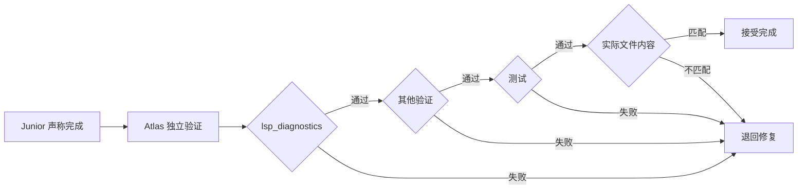
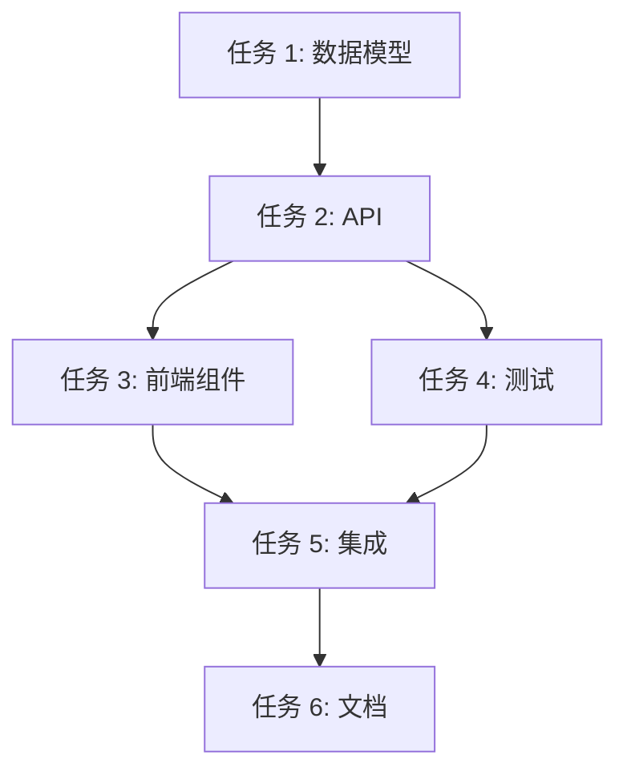
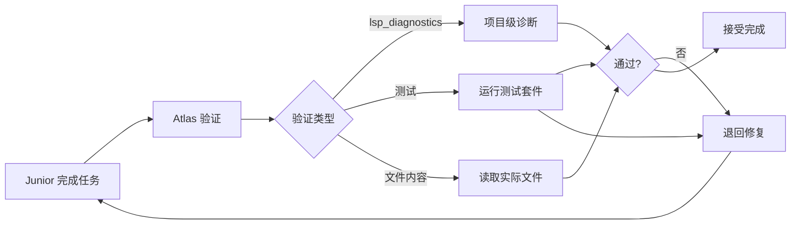

# 开发最佳实践

> 📖 **本文档适合**：希望最高效使用 Oh My OpenCode 的开发者
>
> 🎯 **目标**：掌握专家级工作流，避免常见陷阱

---

## 目录

- [核心原则](#核心原则)
- [任务选择策略](#任务选择策略)
- [提示词工程](#提示词工程)
- [验证和调试](#验证和调试)
- [团队协作](#团队协作)
- [性能优化](#性能优化)

---

## 核心原则

### 原则 1: 正确使用模式

Oh My OpenCode 提供三种主要模式，选择正确的模式是高效使用的关键。

#### 🎯 决策树

```
任务复杂度评估
    │
    ├─ 简单任务（1-2 步）
    │   └─ → 直接对话（最快）
    │
    ├─ 中等任务（3-5 步）
    │   └─ → Ultrawork 模式（平衡）
    │
    └─ 复杂任务（多文件/多天）
        │
        ├─ 需要精确控制？
        │   ├─ 是 → Prometheus 模式
        │   └─ 否 → Ultrawork 模式
        │
        └─ 需要决策记录？
            ├─ 是 → Prometheus 模式
            └─ 否 → Ultrawork 模式
```

#### 实际应用

| 任务类型 | 复杂度 | 推荐模式 | 理由 |
|---------|-------|---------|------|
| 修复拼写错误 | 低 | 直接对话 | 过度配置浪费时间 |
| 修复简单 bug | 低 | 直接对话 | 快速反馈 |
| 添加单个功能 | 中 | Ultrawork | 自动理解项目结构 |
| 重构模块 | 中-高 | Ultrawork 或 Prometheus | Prometheus 更可控 |
| 实现大型功能 | 高 | Prometheus | 需要详细规划和验证 |
| 多天项目 | 高 | Prometheus | 支持会话中断恢复 |

#### 常见错误

**❌ 错误 1：过度使用 Prometheus**
```
错误做法：
/plan "修复 LoginButton 中的拼写错误"
```

**问题：**
- Prometheus 会进行完整采访
- 生成详细的计划
- 执行同样的简单任务
- 浪费大量 token 和时间

**✅ 正确做法：**
```
直接告诉 Sisyphus：
修复 LoginButton 中的拼写错误
```

**❌ 错误 2：对复杂任务使用 Ultrawork**
```
错误做法：
ulw 重构整个认证系统、支付系统、用户管理...（20+ 个子功能）
```

**问题：**
- 可能遗漏边缘情况
- 验收标准不明确
- 难以验证完成度

**✅ 正确做法：**
```
使用 Prometheus：
@plan 重构认证系统
[回答详细采访]
[审查生成的详细计划]
/start-work
```

---

### 原则 2: 信任但验证

Oh My OpenCode 的核心设计哲学之一是"永远不要相信代理的自我报告"。但在实际使用中，很多开发者过度干预。

#### 🤔 理解验证机制



**Atlas 的验证是强制和独立的。**

#### ❌ 错误做法：提前检查代码

```
错误工作流：
1. 代理："我已经实现了登录功能"
2. 你：[立即打开代码检查]"看起来不错，继续下一个任务"
3. 后：发现 bug，需要手动修复
```

**问题：**
- 验证不是自动的
- 代理可能产生幻觉
- 你承担了本该由系统负责的工作

#### ✅ 正确做法：让系统验证

```
正确工作流：
1. 代理："我已经实现了登录功能"
2. [系统自动运行 lsp_diagnostics]
3. [系统自动运行测试]
4. [系统读取实际文件内容]
5. [系统验证通过] → [接受完成]
6. [系统验证失败] → [退回修复]
```

**你的工作：** 只在必要时干预（验证持续失败或需要决策）。

---

### 原则 3: 充分利用专业化

Oh My OpenCode 的强大之处在于多个专业代理协作。学会正确委托是关键。

#### 🎯 什么时候委托？

**委托决策树：**

```
任务分析
    │
    ├─ 需要代码搜索？
    │   ├─ 是 → delegate_task(agent="explore")
    │   └─ 否 → 继续
    │
    ├─ 需要文档查找？
    │   ├─ 是 → delegate_task(agent="librarian")
    │   └─ 否 → 继续
    │
    ├─ 需要架构建议？
    │   ├─ 是 → delegate_task(agent="oracle")
    │   └─ 否 → 继续
    │
    ├─ 是前端/UI 工作？
    │   ├─ 是 → delegate_task(category="visual-engineering")
    │   └─ 否 → 继续
    │
    └─ 常规实现？
        ├─ 复杂逻辑 → delegate_task(category="ultrabrain")
        ├─ 简单任务 → delegate_task(category="quick")
        └─ 中等任务 → delegate_task(category="unspecified-low")
```

#### 实际示例

**场景：添加认证功能**

```typescript
// ❌ 错误：Sisyphus 自己做所有事情
// Sisyphus 自己探索、研究、实现 UI、实现逻辑...
// 效率低，质量次优

// ✅ 正确：委托给专业代理
delegate_task(agent="explore", background=true, prompt="找到认证相关代码")
delegate_task(agent="librarian", background=true, prompt="查找 NextAuth 最佳实践")

// 等待结果
const exploreResult = await background_output(task_id="explore_1")
const librarianResult = await background_output(task_id="librarian_1")

// 使用研究结果实现
delegate_task(
  category="unspecified-low",
  prompt=`实现认证功能。
  现有代码位置：${exploreResult.files}
  最佳实践参考：${librarianResult.docs}`,
)
```

#### 并行委托的最佳实践

```typescript
// 可以并行启动多个代理
const exploreTask = delegate_task(agent="explore", background=true, prompt="...")
const librarianTask = delegate_task(agent="librarian", background=true, prompt="...")
const oracleTask = delegate_task(agent="oracle", background=true, prompt="...")

// 所有任务在后台运行
// 继续做其他工作...

// 稍后获取结果
const exploreResult = await background_output(task_id="exploreTask.task_id")
const librarianResult = await background_output(task_id="librarianTask.task_id")
const oracleResult = await background_output(task_id="oracleTask.task_id")

// 组合所有结果进行决策
```

---

## 任务选择策略

### 策略 1: 任务分解

#### 为什么分解任务？

大任务会导致：
- 上下文过载
- 目标漂移
- 难以验证
- 失败成本高

#### 如何正确分解？

**Prometheus 会的自然分解：**

```
大任务："实现电商购物车"

Prometheus 分解为：
1. 设计数据模型
2. 实现后端 API
3. 实现前端组件
4. 集成支付网关
5. 添加单元测试
6. 添加集成测试
7. 性能优化
8. 编写文档
```

**手动分解准则：**

1. **每个任务应该可以在 < 100k token 内完成**
2. **任务之间应该有明确的依赖关系**
3. **每个任务应该有清晰的验收标准**
4. **避免任务重叠**

---

### 策略 2: 依赖管理

#### 依赖关系



**Oh My OpenCode 的优势：**

- **自动处理依赖**：Atlas 会分析任务依赖
- **并行执行独立任务**：任务 1、3、4 可以并行
- **等待阻塞任务**：自动等待依赖完成
- **累积学习**：任务 2 的学习传递给任务 3、4

---

## 提示词工程

### 原则 1: 清晰但简洁

#### ❌ 不好的提示词

```
过长、过度详细：
"我需要你帮我实现一个用户认证功能。具体来说，
我想要在 Next.js 14 中使用 NextAuth.js 来实现。
我需要支持以下登录方式：
1. 使用邮箱和密码的常规登录
2. 使用 Google OAuth 的社交登录
3. 使用 GitHub OAuth 的社交登录

关于邮箱登录：
- 邮箱格式需要验证
- 密码需要至少 8 个字符，包含大小写字母和数字
- 需要有'忘记密码'功能

关于 OAuth 登录：
- 需要在用户数据库中存储 OAuth provider 和 provider user id
- 需要处理首次登录的用户创建
- 需要处理已存在用户的链接

数据库方面：
- 我使用 Prisma ORM
- 用户表在 lib/db/schema.prisma 中
- 需要添加 OAuthAccount 表

页面方面：
- 登录页面在 app/auth/signin/page.tsx
- 需要创建一个新的注册页面在 app/auth/signup/page.tsx
- 登录成功后重定向到 dashboard

..."
```

**问题：**
- 消耗大量 token
- 代理可能被过多的细节淹没
- 缺乏灵活性

#### ✅ 好的提示词

```
简洁、高层：
"添加用户认证功能，支持邮箱、Google 和 GitHub 登录。"
```

**为什么这样更好？**

1. **Ultrawork 模式**：代理会自动探索项目结构
2. **Prometheus 模式**：代理会通过采访了解细节
3. **灵活性**：让代理决定具体实现细节

---

### 原则 2: 上下文提供

#### 何时提供上下文？

**需要上下文的场景：**

```
✅ 需要上下文：
"在 src/components/Header.tsx 中添加购物车图标"

✅ 需要上下文：
"重构 utils/api.ts 中的 fetchUser 函数，参考现有的 error handling 模式"

❌ 不需要上下文：
"实现用户登录功能"
```

**如何提供上下文？**

```typescript
// ❌ 不够：
"添加购物车按钮到 Header"

// ✅ 更好：
"在 src/components/Header.tsx 中添加购物车按钮。
当前 Header 在右上角有用户资料图标。
购物车按钮应该放在用户图标左边。
参考 src/components/UserIcon.tsx 的样式。"
```

---

### 原则 3: 明确验收标准

#### 验收标准的重要性

没有明确的验收标准，代理可能会：

- 完成部分功能
- 忽略边界情况
- 生成不完整的代码

#### 如何写好验收标准？

```
✅ 好的验收标准：
- [ ] 用户可以通过邮箱和密码成功登录
- [ ] 登录失败时显示错误消息
- [ ] '忘记密码'功能可以重置密码
- [ ] Google OAuth 登录流程正常工作
- [ ] 所有错误情况都有适当的错误处理
- [ ] 单元测试通过（> 80% 覆盖率）
- [ ] TypeScript 编译无错误
- [ ] ESLint 无警告

❌ 不好的验收标准：
- [ ] 实现登录功能
- [ ] 测试通过
```

---

## 验证和调试

### 最佳实践 1: 让系统验证

**回顾：** Oh My OpenCode 有独立的验证机制，不要手动替代它。

#### 系统的验证流程



#### ❌ 错误做法：跳过系统验证

```
错误流程：
1. 代理："我已经完成了登录功能"
2. 你："好的，让我看看代码"[手动检查]
3. 你："看起来不错，接受完成"[绕过系统验证]
4. 后：发现 bug，需要手动修复
```

#### ✅ 正确做法：让系统完成验证

```
正确流程：
1. 代理："我已经完成了登录功能"
2. [系统自动：lsp_diagnostics] ← 运行验证
3. [系统自动：运行测试] ← 运行验证
4. [系统自动：读取文件] ← 运行验证
5. [系统：所有验证通过] ← 接受完成
6. [系统：验证失败] ← 退回修复
```

**你的工作：** 等待系统报告，不要提前干预。

---

### 最佳实践 2: 调试失败的任务

#### 当任务持续失败时

如果任务失败 3+ 次：

```typescript
// 1. 查看失败历史
session_search(query="login implementation failed", limit=10)

// 2. 读取详细会话
session_read(session_id="ses_xxx", include_transcript=true)

// 3. 查找根本原因
// - 是技术问题？
// - 是需求不清楚？
// - 是上下文不足？

// 4. 升级到 Oracle
delegate_task(
  agent="oracle",
  prompt="分析为什么登录功能实现持续失败。失败历史：[粘贴失败详情]"
)
```

#### 常见失败原因

| 原因 | 解决方案 |
|------|--------|
| 需求不清楚 | 使用 Prometheus 重新规划 |
| 上下文不足 | 使用 explore/librarian 先研究 |
| 模型能力不足 | 切换到更强的模型 |
| 任务太大 | 分解为更小的任务 |
| 验收标准不明确 | 明确具体的验收标准 |

---

## 团队协作

### 最佳实践 1: 共享配置

#### 配置管理策略

```
团队配置结构
shared-config/
├── base-config.json           # 基础配置（所有项目共享）
├── project-a-config.json      # 项目 A 特定配置
├── project-b-config.json      # 项目 B 特定配置
└── README.md                # 配置说明
```

#### 使用符号链接

```bash
# 在每个项目中
ln -s ~/shared-config/base-config.json .opencode/oh-my-opencode.json

# 项目特定的覆盖
ln -s ~/shared-config/project-a-config.json .opencode/project-config.json
```

---

### 最佳实践 2: 标准化工作流

#### 团队工作流程

```
1. 代码审查前
   └─> 使用 Prometheus 生成详细计划

2. 实现代码
   └─> 使用 Atlas 执行计划

3. 提交代码
   └─> 使用 Git Master 技能

4. 代码审查
   └─> 使用 Oracle 审查架构

5. 合并到主分支
   └─> 注意：必须合并到 dev 分支！
```

#### PR 模板

```markdown
## 描述

使用 Prometheus 生成的计划：[链接到 .sisyphus/plans/xxx.md]

## 变更

- [ ] 添加的功能
- [ ] 修复的问题
- [ ] 重构的内容

## 测试

- [ ] 单元测试通过
- [ ] 集成测试通过
- [ ] 手动测试通过

## 学习内容

学习内容：[链接到 .sisyphus/notepads/xxx/learnings.md]
```

---

## 性能优化

### 优化 1: 模型选择

#### 成本 vs. 质量

| 任务类型 | 推荐 Category | 成本 | 质量 | 理由 |
|---------|-------------|------|------|------|
| 拼写错误 | quick | 极低 | 不需要推理 |
| 简单重构 | unspecified-low | 低 | Sonnet 足够 |
| 架构决策 | ultrabrain | 高 | 需要深度思考 |
| UI 设计 | visual-engineering | 中 | Gemini 专精 |
| 代码搜索 | explore (agent) | 极低 | Haiku 够快 |

#### Category 配置示例

```json
{
  "categories": {
    "quick": {
      "model": "anthropic/claude-haiku-4-5",
      "temperature": 0.1,
      "description": "Trivial tasks - use fastest/cheapest model"
    },
    "unspecified-low": {
      "model": "anthropic/claude-sonnet-4-5",
      "temperature": 0.2,
      "description": "Medium complexity - use balanced model"
    },
    "ultrabrain": {
      "model": "openai/gpt-5.2-codex",
      "variant": "xhigh",
      "thinking": {
        "type": "enabled",
        "budgetTokens": 64000
      },
      "description": "Complex logic - use most capable model"
    },
    "visual-engineering": {
      "model": "google/gemini-3-pro",
      "temperature": 0.8,
      "description": "UI/UX - use visual specialist"
    }
  }
}
```

---

### 优化 2: 并发控制

#### 背景代理并发度

```json
{
  "background_task": {
    "defaultConcurrency": 3,  // ← 平衡的默认值

    "providerConcurrency": {
      "anthropic": 2,  // ← 限制昂贵模型
      "openai": 3,
      "google": 5,       // ← 允许便宜模型更高并发
      "zai-coding-plan": 5
    },

    "modelConcurrency": {
      "anthropic/claude-opus-4-5": 1,  // ← 最昂贵模型，严格限制
      "anthropic/claude-haiku-4-5": 5,  // ← 便宜模型，允许更高并发
      "google/gemini-3-flash": 10
    },

    "staleTimeoutMs": 300000  // ← 超时任务自动取消（5 分钟）
  }
}
```

#### 超时策略

```typescript
// 快速任务：快速超时
delegate_task(category="quick", timeoutMs=60000)  // 1 分钟

// 中等任务：中等超时
delegate_task(category="unspecified-low", timeoutMs=300000)  // 5 分钟

// 复杂任务：长超时
delegate_task(category="ultrabrain", timeoutMs=900000)  // 15 分钟
```

---

### 优化 3: 上下文管理

#### 动态上下文修剪

```json
{
  "experimental": {
    "dynamic_context_pruning": {
      "enabled": true,

      "turn_protection": {
        "enabled": true,
        "turns": 3  // ← 保护最近 3 轮对话
      },

      "strategies": {
        "deduplication": {
          "enabled": true  // ← 删除重复的工具调用
        },
        "supersede_writes": {
          "enabled": true,           // ← 写入后读取时修剪写入
          "aggressive": false          // ← 只修剪直接被读取的写入
        },
        "purge_errors": {
          "enabled": true,
          "turns": 5  // ← 5 轮后删除错误输入
        }
      }
    }
  }
}
```

#### 修剪效果

```
未启用修剪：
[1] Read file
[2] Edit file (100 tokens)
[3] Read file again (100 tokens)
[4] Edit file (100 tokens)
...
Total: 1000 tokens

启用修剪后：
[1] Read file
[2] Edit file (100 tokens)
[3] Read file again ← 修剪了之前的 Read
[4] Edit file (100 tokens)
Total: 300 tokens (节省 70%)
```

---

### 优化 4: Token 效率技巧

#### 技巧 1: 使用 Category 而非直接指定模型

```typescript
// ❌ 不好：硬编码模型
delegate_task(model="anthropic/claude-opus-4-5", prompt="fix typo")
// ← 昂贵模型做简单任务

// ✅ 好：使用 Category
delegate_task(category="quick", prompt="fix typo")
// ← 自动使用 Haiku，成本降低 10x
```

#### 技巧 2: 批量处理

```typescript
// ❌ 不好：每个小任务一个请求
for (const item of items) {
  await delegate_task(category="quick", prompt=`Process ${item}`)
}

// ✅ 好：批量处理
await delegate_task(
  category="quick",
  prompt=`Process these ${items.length} items: ${items.map(i => i.name).join(', ')}`
)
// ← 更少的会话开销，更好的上下文
```

#### 技巧 3: 避免重复探索

```typescript
// ❌ 不好：每次任务都探索
const task1Result = await delegate_task(agent="explore", prompt="find auth code")
const task2Result = await delegate_task(agent="explore", prompt="find user code")
const task3Result = await delegate_task(agent="explore", prompt="find api code")

// ✅ 好：一次探索，复用结果
const exploreResult = await delegate_task(
  agent="explore",
  prompt="Find all authentication, user management, and API related code"
)
// ← 一次全面探索，后续任务使用结果
```

---

## 总结

遵循这些最佳实践，你可以：

✅ **高效使用 Oh My OpenCode**
- 正确选择工作模式
- 充分利用专业代理
- 让系统验证而非手动干预

✅ **优化性能和成本**
- 智能选择模型
- 控制并发度
- 管理上下文
- 批量处理任务

✅ **提高代码质量**
- 明确的验收标准
- 完整的验证流程
- 累积的学习和约定

✅ **改善团队协作**
- 标准化工作流
- 共享配置
- 完整的文档

---

## 📖 相关文档

- [功能完整参考](../features/complete-reference.md) - 了解所有可用工具
- [配置指南](../configurations.md) - 定制你的设置
- [常见问题解答](../troubleshooting/faq.md) - 解决具体问题
