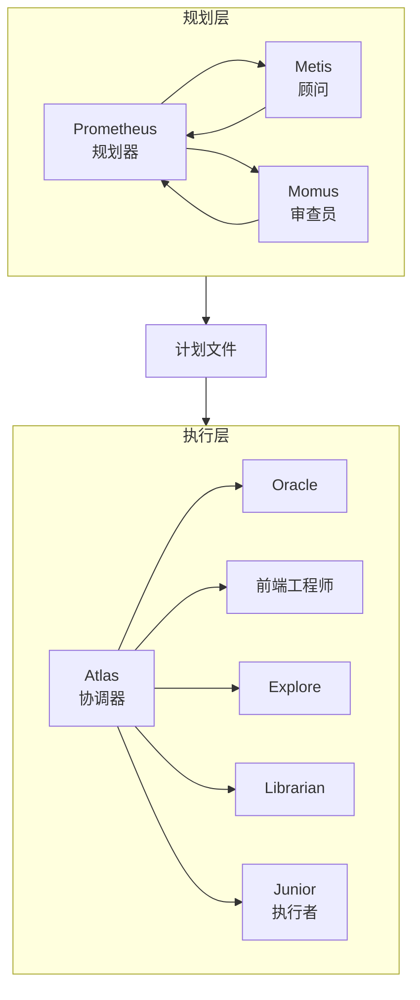

# 深入理解编排系统

本文档全面介绍 Oh My OpenCode 的编排系统架构，解释 Prometheus → Atlas → Junior 工作流的设计哲学和工作机制。

---

## 概述

传统 AI 编码工具经常混合规划和执行，导致：
- 上下文污染（规划细节混入执行）
- 目标漂移（执行过程中偏离原始需求）
- 质量参差不齐（没有验证机制）

Oh My OpenCode 通过清晰分离三个角色来解决这个问题：

1. **Prometheus（规划师）**：只负责"怎么做"
2. **Atlas（协调器）**：负责调度和验证
3. **Junior（执行者）**：只负责"把代码写出来"

---

## 三层架构



---

## 第一层：规划（Prometheus）

### 角色

Prometheus 是一个战略规划师，从不写代码。它专注于"怎么做"而非"做什么"。

### 核心原则

1. **只读模式**：Prometheus 只能创建和修改 `.sisyphus/` 目录内的 markdown 文件
2. **通过采访了解需求**：通过智能提问明确你的真实需求
3. **完整性验证**：确保计划涵盖所有必要任务和边界条件

### 工作流程

#### 阶段 1：采访

Prometheus 会作为你的私人顾问，通过智能提问来收集信息：

```
用户："我想添加用户认证"

Prometheus：
1. 让我先分析一下你的项目... [Explore 在后台运行]
2. 我发现你正在使用 Next.js，有现成的认证组件吗？
3. 你希望使用 NextAuth.js 还是自定义实现？
4. 支持哪些登录方式？邮箱、Google、GitHub？
5. 是否需要用户角色权限系统？
```

#### 阶段 2：计划生成

需求明确后，Prometheus 生成详细的工作计划，保存在 `.sisyphus/plans/{name}.md`：

```markdown
# 用户认证功能实现计划

## 背景与目标
- 当前使用 Next.js 14
- 需要添加邮箱 + Google 登录
- 支持基础角色系统（用户、管理员）

## 任务清单

- [ ] 1. 安装和配置 NextAuth.js
  - 使用你现有的环境变量模式
  - 配置 GitHub OAuth
  - 配置 Google OAuth
- [ ] 2. 创建用户数据模型
  - 在 `lib/db/schema.prisma` 中添加 User 表
  - 运行数据库迁移
- [ ] 3. 实现登录页面
  - 参考现有的 `login/page.tsx` 风格
  - 添加邮箱登录表单
  - 添加 Google 登录按钮
- [ ] 4. 实现 API 路由
  - 创建 `app/api/auth/[...nextauth]/route.ts`
  - 实现会话管理
- [ ] 5. 添加权限检查
  - 创建 `lib/auth.ts` 工具函数
  - 在需要登录的页面中集成

## 验收标准
- [ ] 用户可以通过邮箱登录
- [ ] 用户可以通过 Google 登录
- [ ] 未登录用户无法访问受保护页面
- [ ] 所有测试通过
- [ ] 没有 lint 错误
```

#### 阶段 3：交接

计划创建完成后，Prometheus 会指导你：

```
计划已生成！现在输入 /start-work 来执行。

查看完整计划：.sisyphus/plans/user-auth.md
```

---

## 第二层：顾问（Metis）

### 角色

Metis 是预先规划顾问，识别隐藏的需求和 AI 失败点。

### 工作机制

在 Prometheus 创建计划之前，Metis 必须进行咨询：

1. **隐藏意图检测**：识别你没有明确说明的需求
2. **歧义消除**：发现可能被误解的部分
3. **AI 失败点识别**：预测代理可能犯的错误

### 输出格式

Metis 的分析会作为注释插入计划文件中，帮助 Prometheus 创建更准确的计划。

---

## 第三层：审查（Momus）

### 角色

Momus 是规划审查员，根据清晰度、可验证性和完整性标准验证计划。

### 四大验证标准

| 标准 | 说明 |
|--------|------|
| **清晰度** | 每个任务是否明确指定 WHERE 来查找实现细节？ |
| **可验证性** | 验收标准是否可测量和可测试？ |
| **完整性** | 计划是否涵盖了所有必要任务？ |

### 工作流程

```
Momus 发现问题 → Prometheus 修改计划
         ↓
 Momus 验证计划 → Prometheus → 用户
         ↓
      用户接受 → Momus 通过验证 → 计划批准
```

**Momus 只会说 "OKAY / REJECT"**：
- **OKAY**：计划可以执行
- **REJECT**：计划需要修改

---

## 第四层：协调（Atlas）

### 角色

Atlas 是主编排器，负责执行计划。

### 核心能力

1. **智能任务分发**：将工作委托给合适的专家代理
2. **独立验证**：为每个任务运行独立的验证
3. **持续执行**：直到所有任务完成才停止
4. **跨会话恢复**：通过 `boulder.json` 在会话中断后继续工作

### 工作流程

```mermaid
flowchart LR
    Atlas[Atlas] --> 读取计划
    读取计划 --> 构建并行化图[分析任务]
    构建并行化图 --> 委托任务[分发给专家]
    
    委托任务 --> Oracle[架构咨询]
    委托任务 --> Frontend[UI 实现]
    委托任务 --> Explore[代码库搜索]
    委托任务 --> Librarian[文档研究]
    
    Oracle --> 验证架构设计
    Frontend --> 验证 UI/UX
    Explore --> 验证代码模式
    Librarian --> 验证文档实现
    
    验证架构设计 --> 汇总结果
    验证 UI/UX --> 汇总结果
    验证代码模式 --> 汇总结果
    验证文档实现 --> 汇总结果
    
    汇总结果 --> 所有任务完成?[检查]
    所有任务完成? --> [是] 生成最终报告
    所有任务完成? --> [否] 重新验证或升级到 Oracle
```

### 专业代理委托

Atlas 将任务委托给合适的专家：

| 任务类型 | 委托给 | 原因 |
|----------|--------|------|
| 架构决策 | **Oracle** (GPT 5.2) | 深度逻辑推理，需要广泛分析 |
| 前端 UI/UX | **Frontend Engineer** (Gemini 3 Pro) | 美化设计、样式、动画 |
| 代码库搜索 | **Explore** (Claude Haiku 4.5) | 快速 grep，查找模式 |
| 文档研究 | **Librarian** (GLM 4.7) | 官方文档、开源实现 |

---

## 第五层：执行（Junior）

### 角色

Junior 是任务执行者，专注于实现代码。

### 关键特性

1. **受约束的任务执行**：
   - 不能将任务重新委托给其他代理（防止无限委托循环）
   - 必须完全按照计划中的任务描述执行
   - 在每个任务前验证 `MUST DO` 和 `MUST NOT DO` 约束

2. **Obsessive Todo 追踪**：通过 Todo 系统跟踪每个任务的完成状态

3. **LSP 诊断验证**：在提交代码前运行 `lsp_diagnostics` 检查错误

4. **测试验证**：运行相关测试确保实现正确

### 智能系统

```mermaid
flowchart TB
    Junior[Junior] --> 读取任务[n+1]
    读取任务 --> 执行任务 1[实现]
    执行任务 1 --> 验证[测试]
    验证 --> [通过]?{是}
    
    [通过] --> 任务 1 完成[标记完成]
    [通过] --> 读取任务[n+2]
    循环执行所有任务...
```

---

## 系统提醒机制

### Todo 继续执行器

如果 Junior 在任务完成前停止，系统会强制它继续：

```
当前状态：.sisyphus/boulder.json

{
  "current_task": "Task 3: 实现 API 路由",
  "plan_file": ".sisyphus/plans/user-auth.md",
  "session_id": "ses_abc123"
}

下次启动时：/start-work
结果：从上次停止的地方继续执行
```

---

## 文件组织

```
.sisyyphus/
├── plans/              # 工作计划（.md 文件）
│   ├── {name}.md
│   ├── notepads/          # 累积的知识
│   │   ├── learnings.md    # 成功模式和决策
│   │   ├── decisions.md    # 架构选择和理由
│   │   └── issues.md      # 遇到的问题和解决方案
│   └── problems.md      # 未解决的技术债
└── boulder.json         # 状态文件（跨会话恢复）
```

---

## 何时使用每个模式

| 复杂度 | 推荐方式 | 使用时机 |
|----------|----------|----------|
| **简单** | 直接提示 | 简单任务、快速修复、单文件更改 |
| **复杂 + 懒惰** | Ultrawork | 解释上下文繁琐的复杂任务 |
| **复杂 + 精确** | Prometheus 规划 | 需要真正编排的精确、多步骤工作 |

---

## 下一步

- [安装指南](./installation.md) - 了解如何安装和配置
- [配置指南](../configurations.md) - 自定义模型、代理、类别
- [功能完整参考](../features/complete-reference.md) - 了解所有可用工具
- [分类与技能系统](../category-skill-guide.md) - 深度理解委托机制
